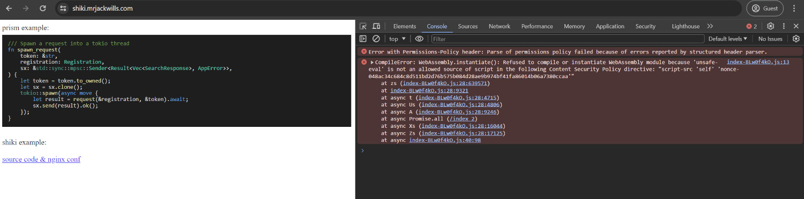

# shiki_example

This is a simple vue application, that is deployed at [shiki.mrjackwills.com](https://shiki.mrjackwills.com).

The only page *should* display two code blocks. The first using [prismJS](https://github.com/PrismJS/prism), the second [shiki](https://github.com/shikijs/shiki)

I have included the [nginx conf](shiki.mrjackwills.com.conf), as I am using nginx to insert a unique random nonce into each request.

If you visit [shiki.mrjackwills.com](https://shiki.mrjackwills.com), you'll notice that the shiki code block doesn't load, due to csp issues, with the error:


```
CompileError: WebAssembly.instantiate(): Refused to compile or instantiate WebAssembly module because 'unsafe-eval' is not an allowed source of script in the following Content Security Policy directive: "script-src 'self' 'nonce-99f8264e4d8b2f7ca97aee762c85eca3d9bb4260ad96e7aecc61212ffc7f2b45'"
```


